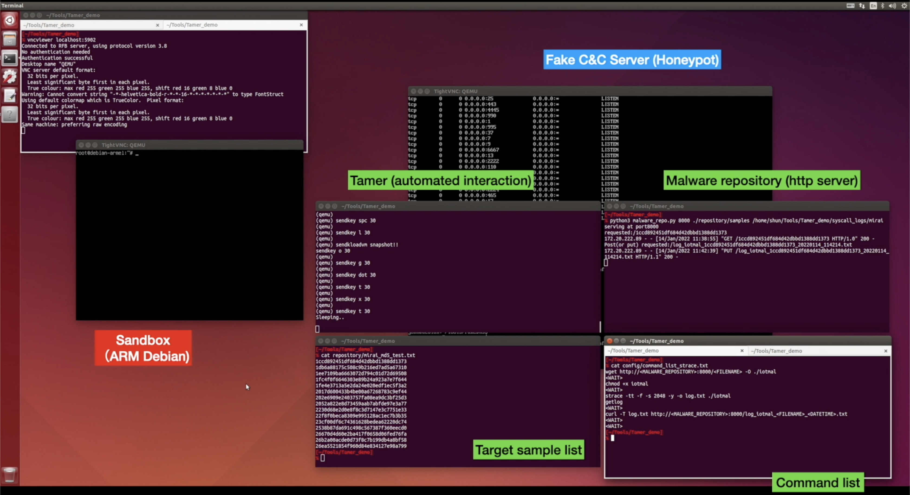

# Tamer: A sandbox for IoT malware analysis

## Summary

Tamer is a sandbox to execute a malware executable in a controlled environment and perform malware analysis.

## Components

- ```tamer.sh``` launches sandbox and execute a malware executables that are listed in an external config file.

- ```auto_interact.py``` is a tool to interact with QEMU using ```expect```. So, it requires ```pexpect```. The applicable usage of ```expect``` for our purpose is based on the video in this [link](https://youtu.be/kdWX0ZWo_8o).

- ```setup_network_config.py``` performs network settings to make a closed and controlled network environment adapted for malware analysis. (It uses ```iptables``` and make settings around linux virtual bridges using ```brctl``` and TUN/TAP interfaces.)

- ```malware_repo.py``` is a http server program where a sandbox requests and downloads a malware sample to be analyzed.


## Usage

```
./tamer.sh analyzed_samples/mirai_md5.txt <IP-address of malware repository's server>
```

## Use case 

### Case 1. Getting syscall logs for all samples in a dataset

This use case can be seen in the video as shown in this [link](https://youtu.be/OfKhdMzeMpA)


As a simple use case, it automate to perform all steps (download samples, launch syscall monitoring, run malware) to perform dynamic malware analysis.



As a result, it allows to perform analyzing invoked syscalls on a lot of samples in an automated manner.




## Dataset

In ```analyzed_samples```, it will contain details and a list of md5 hash of malware samples that we analyzed as a dataset.
